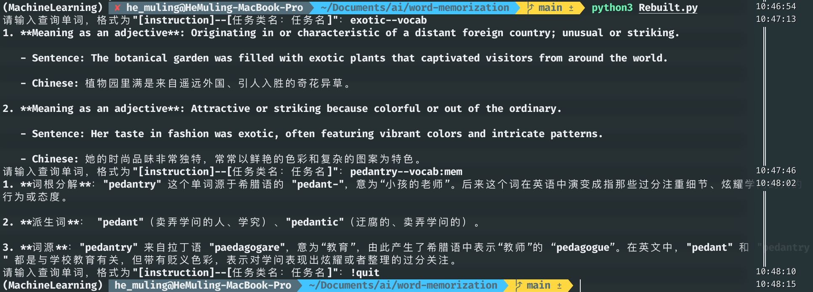

# Words understanding with gpt

## How does it work?/如何运作


本项目支持三种查询类型

```python
exp->帮助理解单词的含义，给出例句
mem->帮助记忆单词，给出词根、派生、词源
logic->帮助记忆多个含义的逻辑关系，给出多个含义，以及它们的逻辑关系
```

本项目会将用户查询的所有单词储存在本地.csv文件中，再次查询时可以直接调用，减少api消耗

请使用以下格式查询

```shell
instruct--task:subtask
```

例如：

```shell
exotic--vocab:mem
```


## example/例子



## usage/使用

本项目需要 Python支持。如果你尚未安装 Python，请访问 [Python 官网](https://www.python.org/) 进行下载和安装。

### 依赖

在终端或PowerShell运行以下命令：

```shell
pip install openai pandas
```

### 配置 OpenAI API 密钥

本项目基于ChatGPT 4-turbo，为了使用 OpenAI 的服务，你需要获取一个 API 密钥

1. 访问 [OpenAI API 官网](https://beta.openai.com/signup/) 并注册账户。
2. 获取你的 API 密钥。
3. 将 API 密钥添加到你的环境变量中：

对于 Unix/Linux/macOS 系统，在终端运行：

```shell
export OPENAI_API_KEY='your_api_key_here'
```

对于 Windows 系统，在命令提示符或 PowerShell 运行：

```shell
set OPENAI_API_KEY='your_api_key_here'
```

### 克隆

在终端或PowerShell运行

```shell
git clone https://github.com/HeMuling/word-memorization.git
```

### 运行

```shell
cd word-memorization
python3 VocabGPT.py
```

### 查询

查询时，请使用

```python
［英语单词］--［vocab:任务名称］
```

例如

```python
trenchant--vocab # 当任务名称缺失时默认为exp
trenchant--vocab:exp
trenchant--vocab:mem
```

### 退出

输入


```python
!quit
```

终止程序运行

## to-do

* 支持学术知识问答
  * 支持学术名词解释
  * 向量索引

